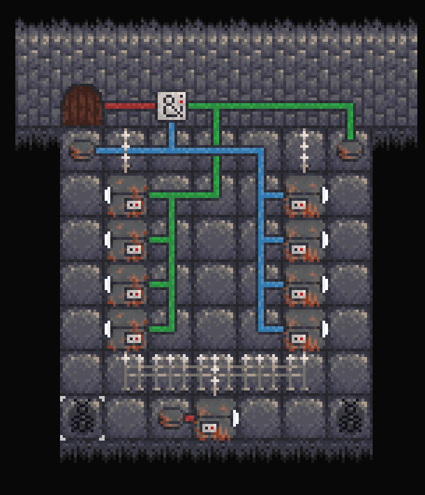

# Ant Factory

Ant Factory  is a puzzle game in which you repair and automate a broken factory using ants.
It was originally created in one week, as part of [a one-week game jam](https://itch.io/jam/week-game-jam-intersemestre-2022/entries) among students at my school.
The theme of the game jam was "Every Death is Meaningful".

This game was entirely made in Javascript and HTML5, using no game engine.
It is available under the BSD-3-clause license.

You can play it on [itch.io](https://shadryx.itch.io/ant-factory) or [on github.io](https://adri326.github.io/ant-factory/), the latter being the most up-to-date version.



## Installation and running

All you need to run the game is a browser, a static http server (the `php` utility will do) and a git client.
First, clone this repository:

```sh
git clone https://github.com/adri326/ant-factory/
cd ant-factory
```

Then, create a local server to serve the files. This step is required because browsers disallow ES6 modules on the `file://` protocol.
If you already have the `php` command available, you may simply run:

```sh
php -S localhost:8080
```

Then, in your browser, navigate to `http://localhost:8080/` and the game should be running.

To bundle all of the code and resources in a neat `.zip` file,

## Controls

The keyboard controls use the [`KeyboardEvent.code` interface](https://developer.mozilla.org/en-US/docs/Web/API/KeyboardEvent/code), which means that they map to the physical position of the key pressed.
If you have an `azerty` keyboard, for instance, you will be able to use `z`, `q`, `s` and `d` to move.

- `w`, `a`, `s` and `d` let you move around, you may only control one ant at a time
- `p` opens the pheromone menu. When open, the following controls are active:
    - `q` enables the auto-pheromone tool, which places pheromone as you move around
    - `t` toggles the "wait" instruction on the current tile
    - `Shift+w`, `Shift+a`, `Shift+s` and `Shift+d` will set the pheromone direction to the corresponding movement direction
    - `x` removes any pheromone where you are
- `r` restarts the level
- `Space` takes control of the nearest ant
- `left click` on an ant to take control of it
- `y` toggles between swapping position with other ants and pushing them
- `Semicolon` toggles running the simulation without your input
- `Period` waits one turn

## Future of the game

Because of the short time period imposed by the game jam, this game is currently at the stage of a demo.
The features implemented are as follows:

- rendering
- player movement, control of other ants
- basic pheromone system
- buttons and logic networks
- logic gates (AND, RS Latch and Clock)
- doors, warps between levels
- HUD
- belts, which can move items and ants
- cranes to move items to/from belts/ants
- distributors and collectors
- lasers (a burnt ant blocks lasers), spikes (once an ant falls in a spike trap it blocks the trap, making it safe)
- machines
- different levels, levels can be customized by changing their source code in the `levels/` directory
- level restart, help messages

There is, however, a lot to be done until I can truly be satisfied by the game:

- [ ] clean up the simulation, removing bugs and quirks caused by update order
- [ ] story-telling: the factory is a factory that creates ants, thus why we can sacrifice ants in the process of automating it
- [ ] clean up the rendering engine, separating what makes up a static background and what is dynamic, having several layers
    - [ ] optimize rendering: pre-render the background, pre-render connected textures, use symbols instead of strings for texture lookup
- [ ] more kinds of traps
- [ ] make different features interact with each other (eg. burnt ants should be movable by belts and should trigger buttons)
- [ ] progress saving
- [ ] properly detect whether a level was automated
- [ ] a hub, where the progress of every level towards the objective can be tracked
- [ ] sounds, music
- [ ] level editor (right now you can use a text editor, but it is quite tedious)
- [ ] more levels, more puzzles
- [ ] proper UI for the messages, proper font for the game
- [ ] clean up the itch.io page to make it more appealing
- [ ] do a pass on every texture and the palette: some things are hard to see
- [ ] move all of the random stuff in index.js into other modules and systems
- [ ] modding support (mods should be separated into those that only touch the levels/ directory and the others)
    - [ ] document the source code
    - [ ] have a way to load mods
    - [ ] keep in mind security :>
- [ ] add a menu (it'll make players feel less lost)
- [ ] maybe move away from aseprite if there is another pixel art software with good palette support

It sounds like a lot and it is a lot, which is why any contribution will be welcome (even a hand-drawing of a level idea).
You can find my contact info [on my website](https://shadamethyst.xyz/).
